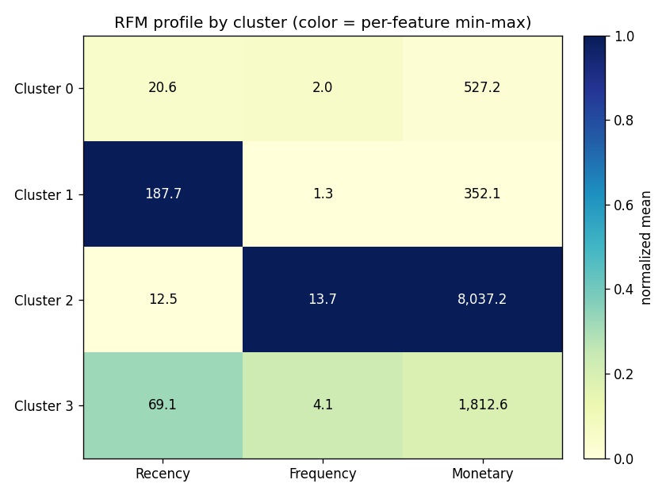
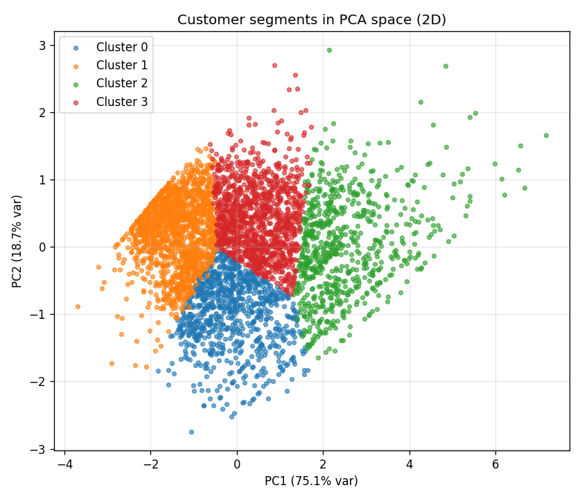
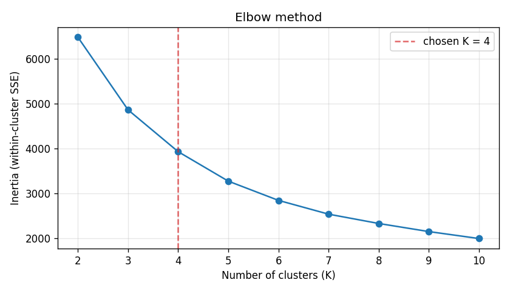
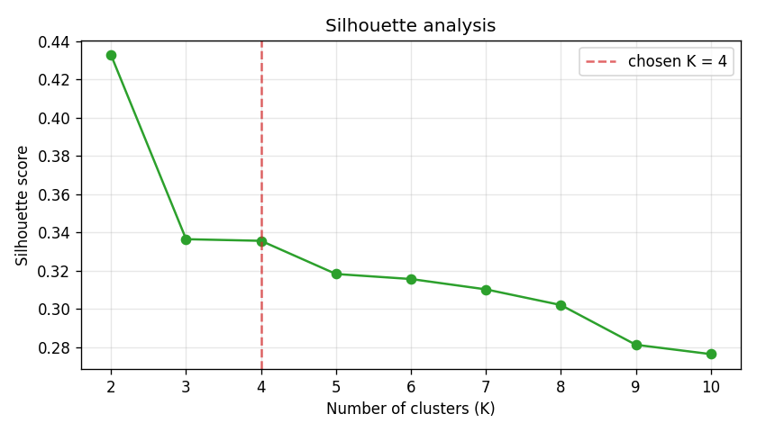

# Customer Segmentation — RFM + Clustering (Segmentify)

Segmentación de clientes de **nivel ingenieril** sobre datos transaccionales
reales (dataset **Online Retail** de UCI). El entregable no es un notebook
suelto, sino un **paquete Python modular** con pipeline ETL reproducible,
ingeniería de características RFM, modelado no supervisado (K-Means), reducción
de dimensionalidad (PCA), visualizaciones, un análisis de negocio y un dashboard
ligero en Streamlit.

Todo el flujo se levanta en Linux/WSL con un entorno virtual y se ejecuta de
principio a fin con **un solo comando** (`make pipeline`).

---

## 📌 Motivación

Un retailer acumula miles de transacciones pero las trata a todas por igual. La
segmentación **RFM** (Recency, Frequency, Monetary) resume el comportamiento de
cada cliente en tres señales accionables:

- **Recency** — días desde la última compra (¿sigue activo?).
- **Frequency** — número de compras (¿es habitual?).
- **Monetary** — gasto total (¿cuánto vale?).

Agrupando clientes por estas señales con K-Means podemos pasar de "541.909
líneas de factura" a **4 segmentos de negocio** con estrategias diferenciadas:
fidelizar a los mejores, reactivar a los que se enfrían y desarrollar a los
nuevos. Este repositorio implementa ese flujo de forma **reproducible y
testeada**.

---

## 🧩 Resultados: los 4 segmentos

Con K=4 (ver [justificación](#elección-de-k)), el pipeline produce esta tabla
(`reports/segment_profiles.csv`):

| Cluster | Persona | Clientes | % | Recency (días) | Frequency | Monetary (£) |
|:--:|---|--:|--:|--:|--:|--:|
| 2 | **Campeones / VIP** | 720 | 16.6% | 12.5 | 13.66 | 8 037.21 |
| 3 | **En riesgo** | 1 162 | 26.8% | 69.1 | 4.13 | 1 812.63 |
| 0 | **Prometedores** | 877 | 20.2% | 20.6 | 2.05 | 527.17 |
| 1 | **Dormidos / Perdidos** | 1 579 | 36.4% | 187.7 | 1.33 | 352.13 |

### Perfil RFM por segmento



### Segmentos en el espacio PCA (2D)

Dos componentes principales explican el **93.8%** de la varianza (PC1 75.1% +
PC2 18.7%), así que el scatter 2D es una representación muy fiel:



### ¿Por qué cada cliente es de un segmento?

El nombre no se asigna a mano: sale de **comparar el RFM medio de cada clúster
con la mediana de todos los clústeres** en dos ejes (regla *data-driven*):

- **¿Reciente?** → Recency por debajo de la mediana (~**45 días**) = ha comprado
  hace poco.
- **¿Valioso?** → Monetary por encima de la mediana (~**£1 170**) = gasta mucho.

El cruce de esos dos ejes da los 4 cuadrantes clásicos del RFM:

| Segmento | ¿Reciente? | ¿Valioso? | Lo que dicen sus números |
|---|:--:|:--:|---|
| 🏆 Campeones / VIP | ✅ (R=12.5) | ✅ (M=£8 037) | compran hace nada, muy a menudo (F=13.7) y carísimo |
| ⚠️ En riesgo | ❌ (R=69.1) | ✅ (M=£1 813) | gastaban bien (F=4.1) pero llevan ~2 meses sin volver |
| 🌱 Prometedores | ✅ (R=20.6) | ❌ (M=£527) | recientes pero compran poco (F=2.0) y barato |
| 💤 Dormidos / Perdidos | ❌ (R=187.7) | ❌ (M=£352) | ~6 meses inactivos, 1 sola compra de bajo valor |

### Interpretación de negocio y acciones

- **🏆 Campeones / VIP** (16.6%) — *Recientes + valiosos.* Son los mejores
  clientes y el motor de ingresos: compran muy recientemente (12.5 días), con
  altísima frecuencia (13.7 compras) y gasto (£8k de media).
  *Acción:* fidelización premium, acceso anticipado, programa VIP. No malgastar
  descuentos: ya compran.

- **⚠️ En riesgo** (26.8%) — *Valiosos pero NO recientes.* Eran buenos clientes
  (£1.8k, ~4 compras) pero llevan ~2 meses sin volver: están enfriándose.
  *Acción:* campañas de reactivación personalizadas y recordatorios **antes** de
  perderlos; es el grupo con mayor retorno por euro invertido.

- **🌱 Prometedores** (20.2%) — *Recientes pero de bajo valor.* Han comprado
  hace poco pero solo una o dos veces y barato (£527). Son nuevos o en
  desarrollo.
  *Acción:* onboarding, cross-sell e incentivar la **segunda compra** para
  convertirlos en leales.

- **💤 Dormidos / Perdidos** (36.4%) — *NI recientes NI valiosos.* ~6 meses
  inactivos, una sola compra de bajo valor. Es el grupo más grande.
  *Acción:* campañas *win-back* de bajo coste; asumir que muchos no volverán y
  no sobreinvertir presupuesto.

---

## 🤖 Cómo funciona el Machine Learning

El núcleo es un pipeline de **aprendizaje no supervisado**: no existen etiquetas
("este cliente es VIP") de antemano; el algoritmo **descubre** los grupos a
partir de los datos. El flujo completo es:

```
RFM por cliente ──▶ escalado (log1p + StandardScaler) ──▶ K-Means (K=4)
                                                              │
                              PCA (solo para dibujar) ◀───────┤
                                                              ▼
                                                   clúster ──▶ persona
```

### 1. Las características: la matriz RFM

Cada cliente se resume en un vector de 3 números: **Recency** (días desde la
última compra), **Frequency** (nº de facturas distintas) y **Monetary** (gasto
total). Es el "ADN" de comportamiento sobre el que trabaja todo lo demás.

### 2. Escalado: preparar los datos para el algoritmo

K-Means agrupa midiendo **distancias** entre clientes, y eso obliga a dos
correcciones (módulo [`models/selection.py`](src/segmentation/models/selection.py)):

- **`log1p` (logaritmo) — corrige el sesgo.** Frequency y Monetary están muy
  sesgadas: casi todos compran poco y unos pocos compran muchísimo (hasta
  £280k). Sin tratarlo, esos pocos *outliers* dominarían la distancia.
  `log1p(x) = log(1+x)` comprime la cola larga y acerca la distribución a una
  forma normal.
- **`StandardScaler` — pone todo en la misma escala.** Recency va de 1 a 374
  (días) y Monetary llega a cientos de miles (£). Sin normalizar, Monetary
  "pesaría" muchísimo más que Recency solo por su magnitud. El scaler resta la
  media y divide por la desviación, dejando cada variable con **media 0 y
  desviación 1**, de modo que las tres cuentan por igual.

Ambos pasos son configurables (`model.log1p`, `model.standardize`).

### 3. K-Means: formar los grupos

K-Means parte el conjunto en **K grupos** minimizando la **inercia** (suma de
las distancias al cuadrado de cada cliente a su centroide). Itera: asigna cada
punto al centroide más cercano → recalcula los centroides → repite hasta que se
estabiliza. Para que el resultado sea **reproducible y robusto**:

- `random_state` fijo (semilla de `config.yaml`) → siempre el mismo resultado.
- `n_init=10` → lo ejecuta 10 veces con arranques distintos y se queda con el
  mejor, evitando "mínimos locales" malos.

### 4. ¿Cuántos grupos? Elegir K

K-Means no decide K solo: hay que dárselo. Se barre K=2..10
([`make train`](src/segmentation/cli.py)) y se miran dos métricas:

|  |  |
|:--:|:--:|

- **Codo (Elbow / inercia):** la inercia siempre baja al subir K. Se busca el
  "codo": el punto donde añadir más clústeres ya **no** reduce mucho el error.
- **Silhouette:** mide si cada cliente está bien dentro de su grupo y lejos del
  vecino (de −1 a 1; cuanto más alto, mejor separación).

El silhouette tiene su máximo en **K=2** (0.43), pero ese corte solo separa
"activos vs. inactivos" — demasiado pobre para accionar marketing. Se elige
**K=4** porque (a) está en la zona del codo, (b) las cuatro personas resultantes
son interpretables y accionables. Queda fijado en `config.yaml`
(`model.chosen_k: 4`) y el log siempre reporta también el pico de silhouette por
transparencia.

### 5. PCA: solo para poder dibujarlo

Los clientes viven en **3 dimensiones** (R, F, M). Para visualizarlos en un
plano, **PCA** las comprime a 2 ejes que conservan la mayor variación posible.
> ⚠️ PCA se usa **únicamente para la figura**: K-Means agrupa con las 3 features
> reales, no con las 2 de PCA. Como las 2 primeras componentes retienen el
> **93.8%** de la varianza, el scatter 2D es una representación muy fiel.

### 6. De clúster a persona

K-Means devuelve grupos anónimos (0, 1, 2, 3). El paso final
([`analysis/personas.py`](src/segmentation/analysis/personas.py)) les pone un
nombre de negocio con la regla de cuadrantes RFM explicada
[arriba](#por-qué-cada-cliente-es-de-un-segmento).

---

## 🗂️ Estructura del repositorio

```
Segmentify/
├── config/config.yaml          # rutas, snapshot_date, k_range, seed, personas
├── data/
│   ├── raw/                     # dataset original (NO se commitea)
│   ├── interim/                 # transactions_clean.parquet
│   └── processed/               # rfm.parquet, rfm_clustered.parquet
├── docs/img/                    # figuras para este README
├── reports/
│   ├── figures/                 # PNGs generados (elbow, silhouette, pca, perfiles)
│   └── segment_profiles.csv     # tabla de segmentos
├── src/segmentation/
│   ├── config.py                # carga y valida config.yaml (dataclass)
│   ├── etl/                     # extract.py · transform.py · load.py
│   ├── features/rfm.py          # cálculo de Recency/Frequency/Monetary
│   ├── models/                  # selection.py (Elbow+silhouette) · clustering.py
│   ├── viz/plots.py             # elbow, silhouette, scatter PCA, perfiles RFM
│   ├── analysis/personas.py     # clúster -> persona de negocio
│   ├── dashboard/app.py         # app Streamlit (lee data/processed)
│   └── cli.py                   # CLI: etl|features|train|viz|analysis|all
└── tests/                       # pytest (transform, rfm, selection, clustering, …)
```

---

## 🛠️ Stack

Python 3.11/3.12 · pandas · numpy · scikit-learn (KMeans, StandardScaler, PCA,
silhouette) · matplotlib · streamlit · PyYAML · typer · pytest · ruff. Versiones
fijadas en [`requirements.txt`](requirements.txt); todo lo estocástico usa
`random_state` desde `config.yaml` para reproducibilidad.

---

## 📥 Dataset

Se usa el **Online Retail Dataset** (UCI Machine Learning Repository): un
`.xlsx` con ~541.909 líneas de factura de un retailer online del Reino Unido
(`InvoiceNo`, `StockCode`, `Description`, `Quantity`, `InvoiceDate`,
`UnitPrice`, `CustomerID`, `Country`).

> ⚠️ El dataset **no se incluye** en el repositorio (`.gitignore` excluye
> `data/raw/`). Descárgalo y colócalo en:
>
> ```
> data/raw/Online Retail.xlsx
> ```
>
> El nombre de fichero es configurable en `config/config.yaml` →
> `dataset.raw_filename`. Si falta, el ETL **se detiene y lo pide** — nunca
> genera datos falsos.

Fuentes habituales: [UCI ML Repository — Online Retail](https://archive.ics.uci.edu/dataset/352/online+retail)
o Kaggle (puede requerir login).

---

## ⚙️ Setup (WSL Ubuntu / Linux, Python 3.12)

El proyecto se ejecuta en **WSL con Ubuntu**. Como Ubuntu reciente trae Python
3.14 (sin wheels para el stack fijado), se usa **Python 3.12**.

```bash
# 1) Herramientas del sistema (una sola vez)
sudo apt install make
# Si no tienes Python 3.12:
sudo add-apt-repository ppa:deadsnakes/ppa -y
sudo apt update && sudo apt install -y python3.12 python3.12-venv

# 2) Entorno + dependencias (crea .venv con 3.12, instala todo, paquete editable)
make install
```

`make install` equivale a:

```bash
python3.12 -m venv .venv
.venv/bin/pip install --upgrade pip
.venv/bin/pip install -r requirements.txt
.venv/bin/pip install -e .
```

> En Windows (sin `make`) puedes usar los comandos subyacentes directamente,
> p. ej. `python -m venv .venv`, `ruff check .`, `pytest`,
> `python -m segmentation.cli all`.

---

## 🚀 Uso

### Pipeline completo (de `data/raw` a figuras + tabla de segmentos)

```bash
make pipeline       # = python -m segmentation.cli all
```

Encadena: **ETL → RFM → selección de K + clustering → PCA/figuras → personas**.
Genera `data/interim/`, `data/processed/`, `reports/figures/*.png` y
`reports/segment_profiles.csv`.

### Por etapas

```bash
make etl            # limpia transacciones        -> data/interim/transactions_clean.parquet
make features       # matriz RFM                  -> data/processed/rfm.parquet
make train          # elige K, entrena KMeans     -> data/processed/rfm_clustered.parquet + figuras
make viz            # PCA 2D/3D + perfiles RFM    -> reports/figures/
make analysis       # clúster -> persona          -> reports/segment_profiles.csv
```

Cada etapa equivale a `python -m segmentation.cli <etapa>`. Con `--help` ves
todos los subcomandos:

```bash
python -m segmentation.cli --help
```

### Dashboard (Streamlit)

Consume los artefactos ya generados (no reentrena). Ejecuta primero
`make pipeline`, luego:

```bash
make dashboard      # = streamlit run src/segmentation/dashboard/app.py
```

Incluye KPIs (nº de clientes, nº de segmentos, gasto medio), scatter PCA 2D
interactivo coloreado por segmento, tabla de perfiles y filtro por segmento en
la barra lateral. Si faltan los parquet, muestra un aviso pidiendo correr el
pipeline (no peta).

### Limpieza

```bash
make clean          # borra data/interim, data/processed, figuras y la tabla
```

---

## 🔧 Configuración (`config/config.yaml`)

Nada está hardcodeado. Lo más relevante:

- `seed` — semilla global de reproducibilidad.
- `paths` — directorios de datos y reports.
- `dataset.raw_filename` — nombre esperado del `.xlsx` en `data/raw/`.
- `rfm.snapshot_date` — fecha de referencia para Recency (`null` ⇒
  `max(InvoiceDate) + 1 día`).
- `model.k_range` — rango de K a barrer (2–10).
- `model.chosen_k` — K fijado (ver abajo); `null` ⇒ usa el K óptimo por
  silhouette.
- `personas` — nombres de los segmentos por cuadrante RFM.

### Elección de K y asignación de personas

El detalle del barrido de K (codo + silhouette), del escalado y del PCA está en
la sección [🤖 Cómo funciona el Machine Learning](#-cómo-funciona-el-machine-learning).
En resumen: se fija **K=4** (`model.chosen_k`) por codo + interpretabilidad, y
las personas se asignan de forma *data-driven* por cuadrante RFM (reciente ×
valioso), sin IDs de clúster fijos.

---

## 🧪 Desarrollo

Tres comandos para mantener la calidad del código mientras se desarrolla:

```bash
make lint     # Revisa el código SIN modificarlo: busca errores, imports sin usar,
              # variables muertas y estilo inconsistente (con ruff). Falla si algo
              # no cumple las reglas de pyproject.toml. Úsalo antes de commitear.

make test     # Ejecuta la batería de tests con pytest (carpeta tests/) y comprueba
              # que ETL, RFM, selección de K, clustering y personas siguen dando los
              # resultados esperados. Es la red de seguridad ante cambios.

make format   # Reformatea automáticamente el código al estilo del proyecto
              # (sangrías, comillas, longitud de línea...). A diferencia de `lint`,
              # este SÍ reescribe los ficheros.
```

> Regla del proyecto: antes de cerrar cualquier cambio, `make lint` y `make test`
> deben pasar en verde.

- Código en `src/segmentation/`, tests en `tests/`.
- Cada módulo expone **funciones puras y testeables**; el I/O vive en `etl/load`.
- Tests con un mini-dataset sintético (`tests/conftest.py`) y valores RFM
  calculados a mano.

---

## ♻️ Reproducibilidad

- Toda fuente de aleatoriedad (KMeans, PCA) está sembrada vía `seed` en
  `config.yaml`.
- Versiones de dependencias fijadas en `requirements.txt`.
- El pipeline es determinista: `make clean && make pipeline` regenera
  exactamente los mismos artefactos.

> Nota de entorno: `requirements.txt` fija `matplotlib==3.9.2` (la `3.9.1` no
> tiene wheel para algunas plataformas) y `click==8.1.7` (las `>=8.2` rompen el
> render de ayuda de `typer 0.12`).
